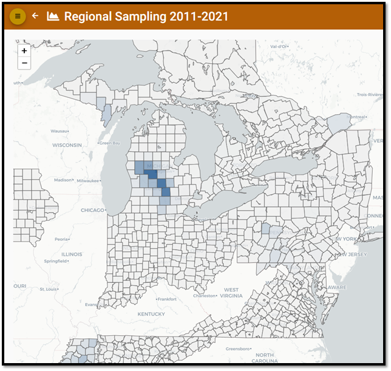

# Visualizations

The Visualization component of the CWD Data Warehouse includes graphics, reporting, and dashboarding functionality to allow agency professionals to summarize their data, explore model outputs, and convey information to their staff. A single visualization may contain one or more elements, such as tables, charts, summaries, and maps.

Some visualizations have specific purposes and therefore require specific data or model executions. For example, the Risk-weighted Surveillance Quotas Model Visualization is designed for model exploration, while the Surveillance Activity Visualization is designed to help an agency track surveillance progress during a sampling period. Similarly, 'ad hoc' visualizations allow an agency the flexibility to present countless data visually on local or regional maps. For example, using an ad hoc map, a user can assess whether, where, or how much their neighbors are sampling.

<figcaption>An example ad hoc visualization depicting sampling across a ten-year period. <em><b>This image does not represent actual data.</b></em></figcaption>

For more details, go to the [CWD Data Warehouse User Manual: Visualizations](https://pages.github.coecis.cornell.edu/CWHL/CWD-Data-Warehouse/visualizations.html){target="_blank"}.