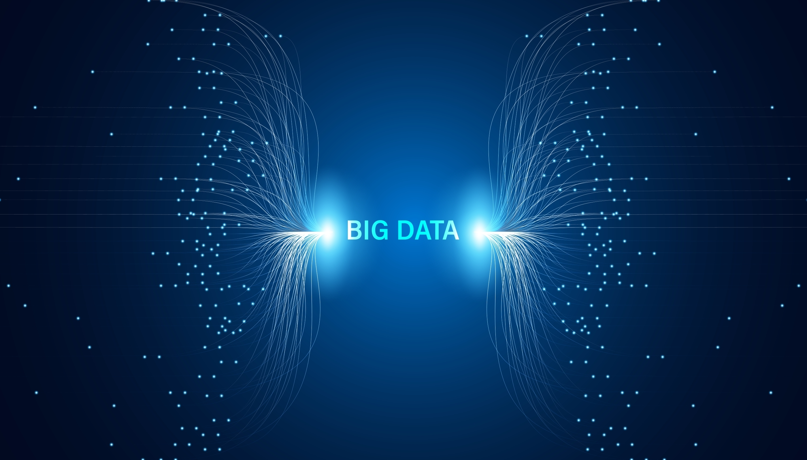

# **Data Collections**

The CWD Data Warehouse provides data storage and management functionality for CWD sample and test data, as well as other related datasets for CWD surveillance, management, and response. Data stored in the Warehouse can be used in analyses (models), data visualizations, and summaries. In the Warehouse, data are stored in “Collections” which are conceptually analogous to tables in relational databases.

The **Sample Collection** represents cervid tissue samples collected for CWD surveillance The Sample Collection includes properties that describe the animal from which the sample was taken, conditions and circumstances under which a sample was collected, and test results. The scope of the collection includes samples from all sources of mortality, including hunter-harvest programs, road kills, clinical suspect cases, captive cervids, and targeted removal efforts. For more details, go to the [CWD Data Warehouse User Manual: Sample Collection.](https://pages.github.coecis.cornell.edu/CWHL/CWD-Data-Warehouse/sample-collection.html){:target="_blank"} 

The **Cervid Facility Collection** consists of data related to captive cervid facilities, including cervid farms, shooting preserves, and breeding or propagation areas. Data can include herd details as well as activities and conditions that are relevant to CWD surveillance and management, such as fencing quality and disposal methods. For more details, go to the [CWD Data Warehouse User Manual: Cervid Facility Collection.](https://pages.github.coecis.cornell.edu/CWHL/CWD-Data-Warehouse/cervid-facility-collection.html){:target="_blank"} 

The **Processor Collection** describes data related to cervid processing businesses, including meat processors and taxidermists. Data can include numbers of deer processed, disposal methods, and other activities conducted on the premises. For more details, go to the [CWD Data Warehouse User Manual: Processor Collection.](https://pages.github.coecis.cornell.edu/CWHL/CWD-Data-Warehouse/processor.html){:target="_blank"} 

The **Demography Collection** contains data of quantitative metrics (e.g., harvest, population, density, fecundity, mortality) that describe the cervid population and processes that affect dynamics of that population. Metrics are aggregated by species, sub-administrative area (county or equivalent), and season-year (the annual period spanning July 1 to June 30). For more details, go to the [CWD Data Warehouse User Manual: Demography Collection.](https://pages.github.coecis.cornell.edu/CWHL/CWD-Data-Warehouse/demography.html){:target="_blank"} 

The **Agency Expense Collection** describes CWD surveillance-related expenses. It allows for documentation of expenses by season-year, sample source (e.g., hunter-harvest, road kill), sample collection program, expense type (e.g., shipping, test fees, staff time), and location (e.g., sub-administrative area or agency management unit). For more details, go to the [Data Warehouse User Manual: Agency Expense Collection.](https://pages.github.coecis.cornell.edu/CWHL/CWD-Data-Warehouse/agency-expense.html){:target="_blank"} 

The **Annual Surveillance Collection** describes the annual surveillance goals of the agency for each season-year. The Collection allows an agency to monitor surveillance activity and provide real-time feedback on sampling progress. An agency may also use the Annual Surveillance Collection to document past surveillance activity to understand how surveillance goals have changed over time and space. For more details, go to the [Data Warehouse User Manual: Annual Surveillance Collection.](https://pages.github.coecis.cornell.edu/CWHL/CWD-Data-Warehouse/annual-surveillance.html){:target="_blank"} 

<figcaption>Photo credit: Shutterstock</figcaption>