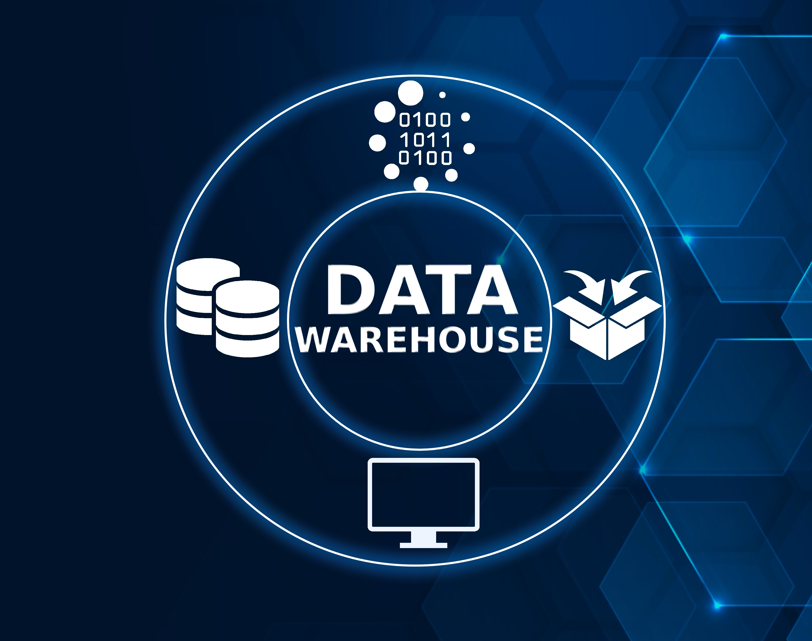

# The CWD Data Warehouse

A product of the SOP4CWD collaboration is the [CWD Data Warehouse](https://cwd-data.org/login){:target="_blank"}, an online platform for CWD surveillance planning and data management available at no cost to state (US and Mexico), provincial (Canada), and tribal wildlife agencies in North America. The CWD Data Warehouse project was developed in partnership with DJ Case & Associates. In order to access the CWD Data Warehouse, agencies must agree to the [Data Use Agreement & Terms of Use.](dua.md)

[**Enter the CWD Data Warehouse**](https://cwd-data.org/login){:target="_blank" .md-button .md-button--primary }

## A Collaborative Platform

A suite of integrated CWD surveillance, modeling, and management tools within the Warehouse provides wildlife agencies access to the mathematical modeling and data science tools they need to efficiently plan surveillance efforts and make data-driven decisions. The CWD Data Warehouse facilitates interagency data-sharing, increases situational awareness, and informs wildlife health decision-making.

## Conceptual Framework

The CWD Data Warehouse is designed around a conceptual model with three components: **Data**, **Models**, and **Visualizations**.

The [**Data**](data.md) component comprises the datasets, including CWD sampling and test data; cervid population demographics; CWD introduction risks; and current surveillance program activities.

The datasets are stored in the Warehouse and serve as inputs for the [**Models**](models\index.md) component, a collection of mathematical models and analyses that can be set-up and run by users. 

The [**Visualizations**](viz.md) component uses the Data and Model results as inputs and presents them as visual elements, such as interactive maps, graphs, and tabular summaries.

## Supporting better data management and surveillance planning

The CWD Data Warehouse supports the development of efficient and effective surveillance plans based on the best available science and mathematical methods. The Warehouse can also serve as the foundation of a data management system for agencies that need a reliable and efficient solution for their surveillance data management and processing. Although the Warehouse is not open to the public, wildlife agencies can use the products to inform and educate people about CWD.

## Play in the Sandbox

A [test](https://test.cwd-data.org/login){:target="_blank"} environment of the Warehouse is available to help prospective users determine if the Warehouse will be useful in their CWD surveillance and management programs prior to joining the project. Currently, an account is needed to access the Sandbox. Please [contact SOP4CWD](../contact.md) to request an account.

<figcaption>Photo credit: Shutterstock</figcaption>
