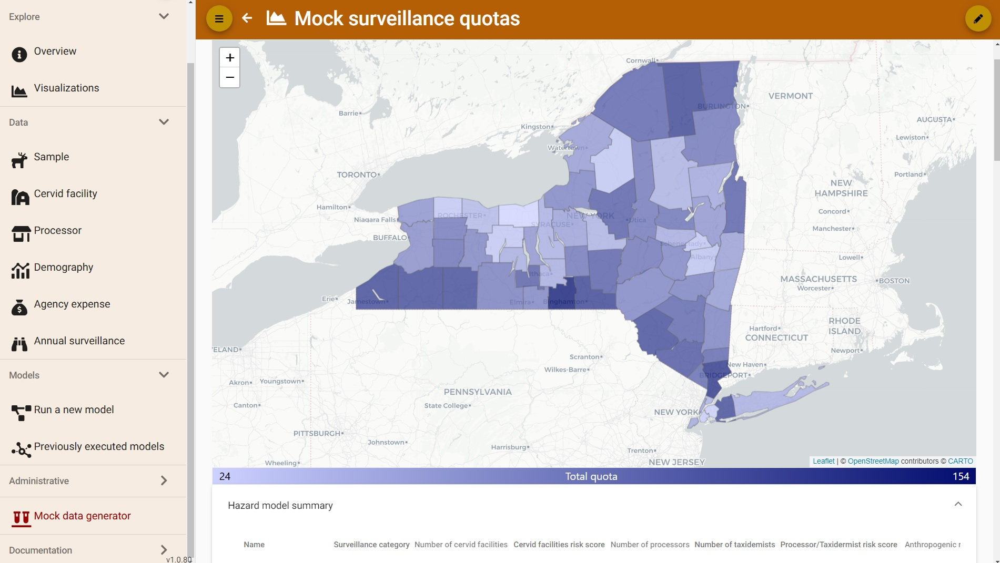

# The CWD Data Warehouse
The [CWD Data Warehouse](https://cwd-data.org/login){target="_blank"} is an online platform for CWD data management and synthesis, surveillance planning, and information sharing across jurisdictional boundaries. It is available at no cost to wildlife agencies representing states (US and Mexico), provinces (Canada), or indigenous nations (North America). 

## A Collaborative Platform
Developed in partnership with <a href="https://djcase.com/" target="_blank">DJ Case & Associates</a>, the CWD Data Warehouse facilitates interagency data-sharing, increases situational awareness, and informs wildlife health decision-making. This is accomplished through standardization of data across agencies, and through a carefully designed system that allows agencies to share critically important surveillance data with neighboring wildlife agencies, all while securing and restricting access to sensitive or confidential data. 

A key element to success of the CWD Data Warehouse has been a well-defined [Data Use Agreement (DUA)](SupportingDocuments.md) that provides clear guardrails for data access, use, and sharing within the Warehouse. All wildlife agencies that join the CWD Data Warehouse are required to approve this DUA which provides protection for all participating wildlife agencies.

## Conceptual Framework
The CWD Data Warehouse is designed around a conceptual framework containing three components: **Data Collections**, **Models**, and **Visualizations**.

* The [**Data Collections**](DataCollections.md) include CWD sampling and test data; cervid population demographics; CWD introduction risks; and current surveillance program activities.

* The data collections serve as inputs for the [**Models**](models\index.md), which are a collection of quantitative tools embedded in the Warehouse that can be run by users with no coding or statistical expertise. These integrated surveillance, modeling, and management functionalities provide wildlife agencies avenues to use their own data to efficiently plan surveillance efforts.

* The [**Visualizations**](Visualizations.md) displays Data summaries and Model outputs in the form of interactive maps, graphs, and comparative tables. Visualizations are useful for data exploration, understanding model results, information sharing both within and across wildlife agencies, and even in keeping apace of day-to-day surveillance activities.

By integrating these three components, the CWD Data Warehouse supports efficient and effective surveillance plans using the most up-to-date agency data.

## Try out the Warehouse Before Accepting the DUA
The CWD Data Warehouse is not open to the public, but there is a Sandbox environment that can be used by people without signing the DUA. The [Sandbox](https://test.cwd-data.org/login){target="_blank"} allows prospective users to explore the CWD Data Warehouse and determine whether the technology will aid surveillance planning at their agency. Please [contact SOP4CWD](../contact.md) to request a Sandbox account.

<figcaption>CWD Data Warehouse Sandbox Environment</figcaption>
