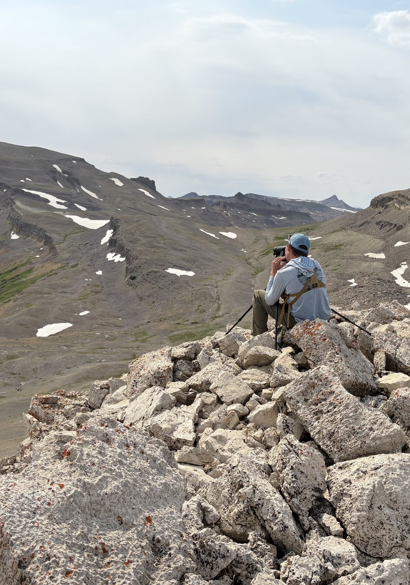

# CWD Sentinel
*In development*

The CWD Sentinel uses all SOP4CWD data in conjunction with deep learning and INLA to predict which sub-administrative areas may (1) turn CWD-positive for the first time, or (2) experience rapid spread of existing infection.

## Geographical Scale
* Administrative area, subdivided into a sub-administrative areas

## Required Data
* Sample data
* Cervid facility data

## Suggested Data
* Demography data
* Taxidermist data
* Meat processor data

## User Inputs
* Season-year

## Outputs
* A map containing the predictions of CWD emergence and spread for each sub-administrative area in your administrative area

<figcaption>The CWD Sentinel is the most powerful machine learning tool to date to predict CWD emergence and spread</figcaption>

## More Information
For more information, go to the [CWD Data Warehouse User Manual: CWD Sentinel](https://pages.github.coecis.cornell.edu/CWHL/CWD-Data-Warehouse/CWDSentinel.html){target="_blank"}.

## Code
To view the code once deployed, go to the [GitHub Repository: Positive Predictor Model](https://github.com/Cornell-Wildlife-Health-Lab/CWD-Sentinel){target="_blank"}.

## Citation
* Gonzalez-Crespo C, Schuler K, Hanley B, Hollingshead N, Middaugh C, Ballard J, Clemons B, Kelly J, Harms T, Caudell J, Benavidez Westrich K, McCallen E, Casey C, O'Brien L, Trudeau J, Stewart C, Carstensen M, Jennelle C, McKinley W, Hynes P, Stevens A, Miller L, Grove D, Storm D, Martinez-Lopez B. Fusing Bayesian inference and deep learning: A hybrid AI approach for predicting chronic wasting disease emergence and spread. _In revision_

