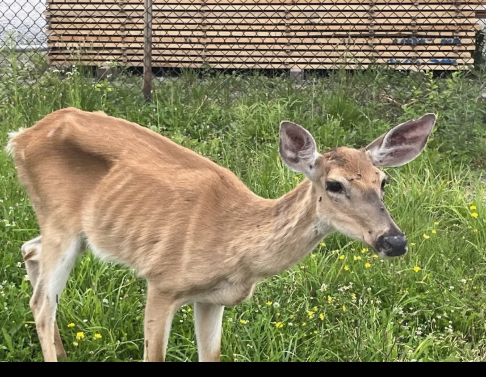

# **Disease Cluster Analysis Data Export**

The Disease Cluster Analysis Data Export allows users to pre-process CWD Warhouse sample data for upload and use in the [SaTScan software](https://www.satscan.org/){:target="_blank"}. The SaTScan software analyzes spatial and temporal data for any of the following interrelated purposes:

* Perform geographical surveillance of disease, to detect spatial or space-time disease clusters and to see if they are statistically significant
* Test whether a disease is randomly distributed over space, time, or space and time
* Evaluate the statistical significance of disease cluster alarms

## Geographical Scale: 
* Exact locations of deer

## Required Data: 
* Sample data, including exact latitude and longitude and harvest date

## Suggested Data: 
* None

## User Inputs: 
* Cervid species
* Season-years(s)
* Scan type (spatial or temporal)

## Outputs: 
* A downloadable file of processed sample data for use in the SaTScan import wizard.
* A downloadable file with a summary of your selected inputs to assist you in creating the model execution in the SaTScan software.

<figcaption>Photo credit: Pennsylvania Game Commission </figcaption>

##

For more details, go to the [CWD Data Warehouse User Manual: Disease Cluster Analysis Data Export.](https://pages.github.coecis.cornell.edu/CWHL/CWD-Data-Warehouse/satscan.html){:target="_blank"}

