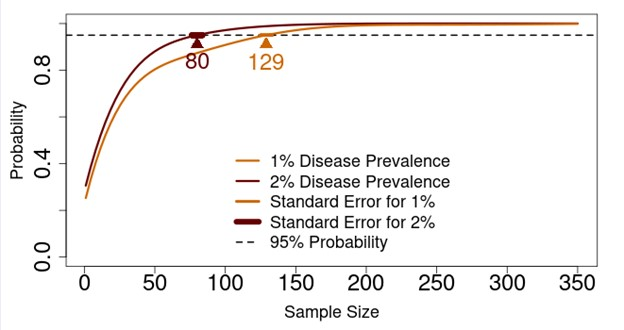

# Efficient Sample Size Calculator
*Deployed*

The Efficient Sample Size Calculator simulates the sample size needed to declare a population free-from-disease while explicitly accounting for the natural clustering behavior of hosts. The Calculator can be used to plan investigations using simple random sampling, high-harvest, or two-stage cluster sampling designs. 

## Geographical Scale
* Population size of interest, regardless of the spatial scale

## User Inputs
* Population of interest
* Average cluster size of hosts
* Whether clusters are fixed or variable in size
* Correlation in disease status among hosts sharing a cluster
* Sensitivity of the diagnostic test used to declare CWD-positive

## Outputs
* The number of hosts that need to be tested without finding a positive case to have high probability (95%) that disease prevalence in the overall population is at or below 1% or 2%. 

<figcaption>Example output from the Efficient Sample Size Calculator.</figcaption>

## More Information
For more information, go to the [CWD Data Warehouse User Manual: Efficient Sample Size Calculator](https://pages.github.coecis.cornell.edu/CWHL/CWD-Data-Warehouse/sample-size.html){target="_blank"}.

## Code
To view the code, go to the [GitHub Repository: Efficient Sample Size Calculator](https://github.com/Cornell-Wildlife-Health-Lab/efficient-sample-size-calculator){target="_blank"}.

## Citations
* Booth JG, Hanley BJ, Hodel FH, Jennelle CS, Guinness J, Them CE, Mitchell CI, Ahmed MS, Schuler KL. 2024. [Sample size for estimating disease prevalence in free-ranging wildlife populations: A Bayesian modeling approach](https://doi.org/10.1007/s13253-023-00578-7). Journal of Agricultural, Biological, and Environmental Sciences. 29, 438–454.
* Booth JG, Hanley BJ, Thompson NE, Gonzalez-Crespo C, Christensen SA, Jennelle CS, Caudell JN, Delisle Z, Guinness J, Hollingshead NA, Them CT, Schuler KL. [Management agencies can leverage animal social structure for wildlife disease surveillance](https://meridian.allenpress.com/jwd/article/doi/10.7589/JWD-D-24-00079/506128/Management-Agencies-Can-Leverage-Animal-Social). Journal of Wildlife Diseases.
* Hanley BJ, JG Booth, FH Hodel, NE Thompson, AA Reeder, JCG Bloodgood, JP Dion, Van de Berg S, Gonzalez-Crespo C, Huang Y, Wang J, Miller LA, Hollingshead NA, Peaslee JL, Schuler KL. 2025. [Efficient sample size calculator](https://doi.org/10.7298/smzr-1a70) [Software]. Cornell University Library eCommons. 