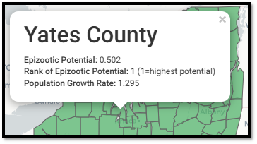

# Epizootic Risk Model
*Deployed*

The Epizootic Risk Model reveals how demographic parameters of the live cervid population may influence CWD dynamics if prions were to be introduced into the herd.

## Geographical Scale
* Administrative area, subdivided into a sub-administrative areas

## Required Data
* Sample data

## Suggested Data
* Demography data

## User Inputs
* Cervid species of interest
* Estimates of demographic factors (if demography data are unavailable)
* Estimates of epidemiological factors

## Outputs
* Estimates of the Epizootic Potential in each sub-administrative area
* Comparative maps of Epizootic Potential by sub-administrative area
* Charts depicting the main drivers of Epizootic Potential within each host population

<figcaption>A screenshot of Epizootic Risk Model output using mock data </figcaption>

## More Information
For more details, go to the [CWD Data Warehouse User Manual: Epizootic Risk Model](https://pages.github.coecis.cornell.edu/CWHL/CWD-Data-Warehouse/epizootic-risk.html){target="_blank"}.