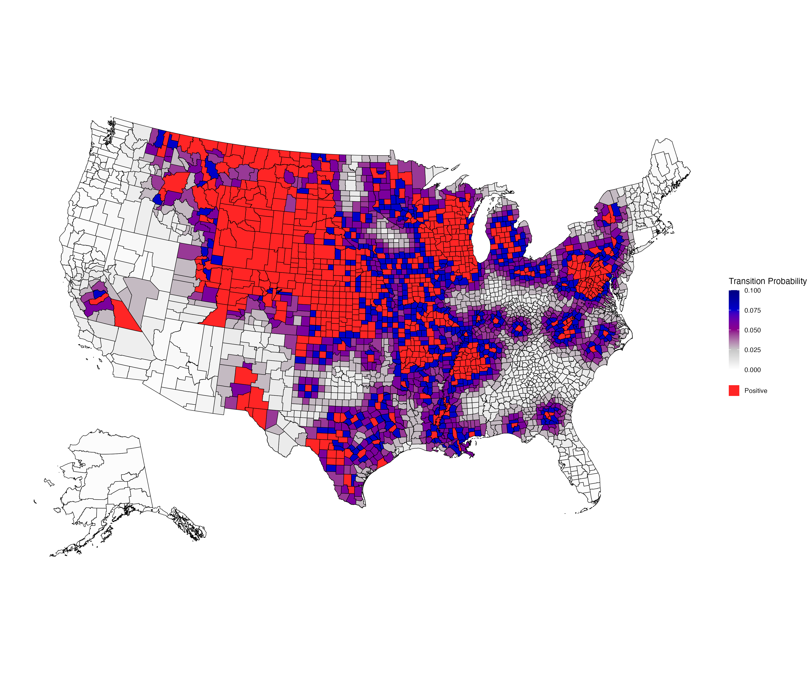

# Hazard Model 2.0

The Hazard Model 2.0 incorporates many possible risk factors for CWD to calculate surveillance quotas per sub-administrative area. Surveillance targets can be used by agencies to plan upcoming surveillance across a region, state, province, or nation.

## Geographical Scale
* Administrative area, subdivided into a sub-administrative areas

## Required Data
* Deer demography data

## Suggested Data
* Cervid facility data
* Taxidermist data
* Meat processor data
* Mineral and/or salt lick data
* Feedground data
* Watering tank/guzzler data
* Baiting station data
* Rendering facility data
* Incineration facility data
* Landfill data
* Food bank data
* Dumped carcass data
* Shed antler collection data
* Local practices data

## User Inputs
* The set of risk factors relevant in the area of interest
* The severity of risk posed by each risk factor

## Outputs
* Baseline spatial risk by sub-administrative area
* Risk profiles across sub-administrative areas
* Hazard profiles across sub-administrative areas
* Surveillance quotas across sub-administrative areas

<figcaption>The baseline spatial risk generated by Sernaker et al. 2026, which is a component of the Hazard Model 2.0. </figcaption>

## More Information
For more information, go to the [CWD Data Warehouse User Manual: Hazard Model 2.0](https://pages.github.coecis.cornell.edu/CWHL/CWD-Data-Warehouse/HM2.html){target="_blank"}.

## Code
To view the code, go to the [GitHub Repository: Hazard Model 2.0](https://github.com/Cornell-Wildlife-Health-Lab/Hazard-Model-2.0){target="_blank"}.

## Citations
* Thompson N, Sernaker S, Hanley B, Cook J, Hollingshead N, Hubbs A, Reed H, LaHue N, Lieske C, Gillin C, Reeder A, Munk B, Wood L, Justice-Allen A, Duvuvuei O, Crockett E, Wycoff S, DeVivo M, Westacott H, Cook W, Heffelfinger L, Wild M, Epps C, Walsh D, Nelson C, Thacker C, Beckmen K, Schuler K. The Hazard Model 2.0: Extension of a risk-based chronic wasting disease surveillance model to the western United States and Canada. _In preparation_ 
* Sernaker S, Hollinghsead N, Hanley B, Schuler K. 2026. [Transition probabilities for chronic wasting disease (CWD) by county across the United States](https://doi.org/10.7298/an2z-1j51) [Software]. Cornell University Library eCommons Repository.