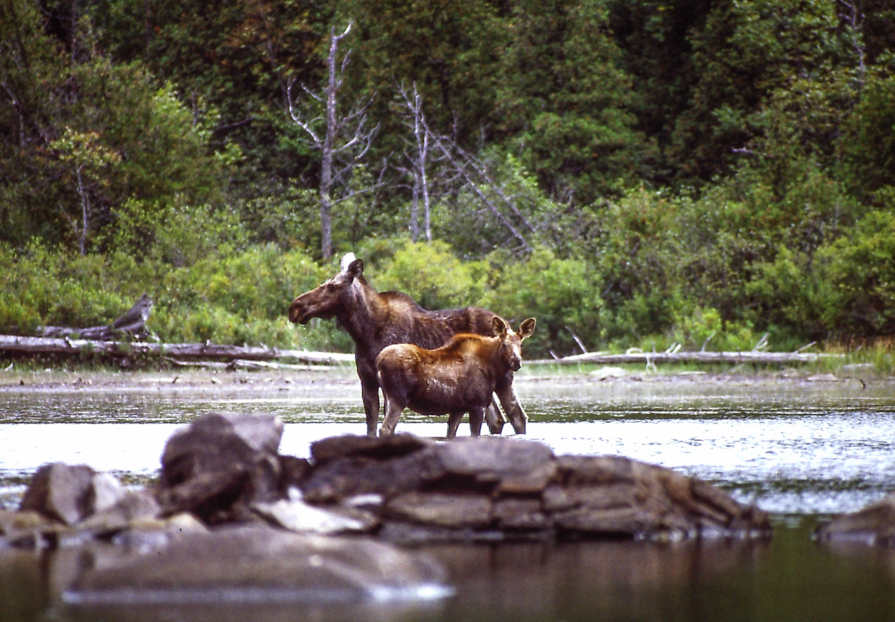

# Home Range Contamination Model (*in development*)

The Home Range Contamination Model is used to determine which home ranges are likely to harbor CWD-positive hosts.

## Geographical Scale: 
* Home range of user-specified sizes (default = 6 sq. km) 

## Required Data: 
* Sample data, with latitude longitude locations
* Geospatial data

## Suggested Data: 
* None

## User Inputs: 
* Cervid species
* Season-year

## Outputs: 
* A map that shows risk of CWD detection by home range and age/sex segment.

<figcaption>Photo credit: Art Kirsch </figcaption>

##

For more details, go to the [CWD Data Warehouse User Manual: Home Range Contamination Model.](https://pages.github.coecis.cornell.edu/CWHL/CWD-Data-Warehouse/habitatrisk.html){:target="_blank"}
