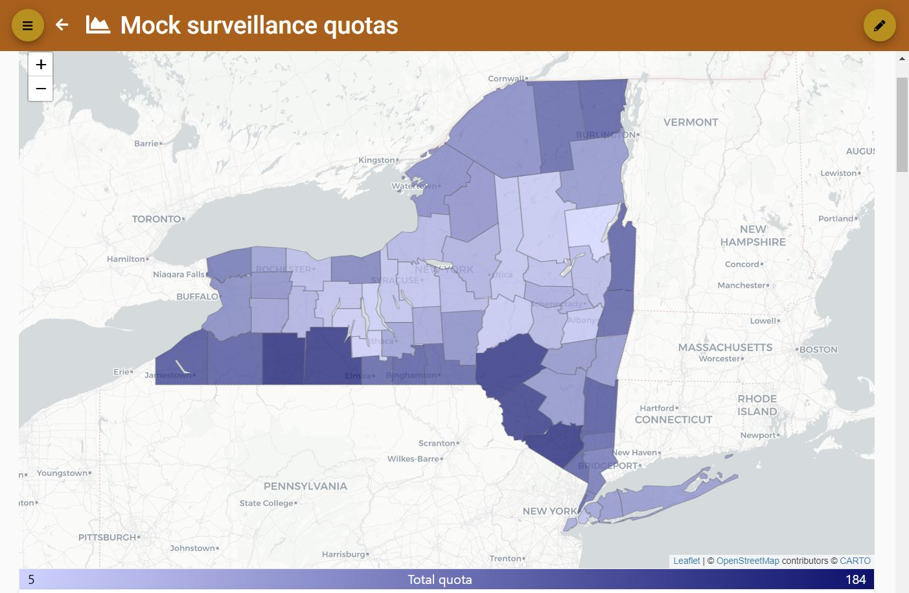
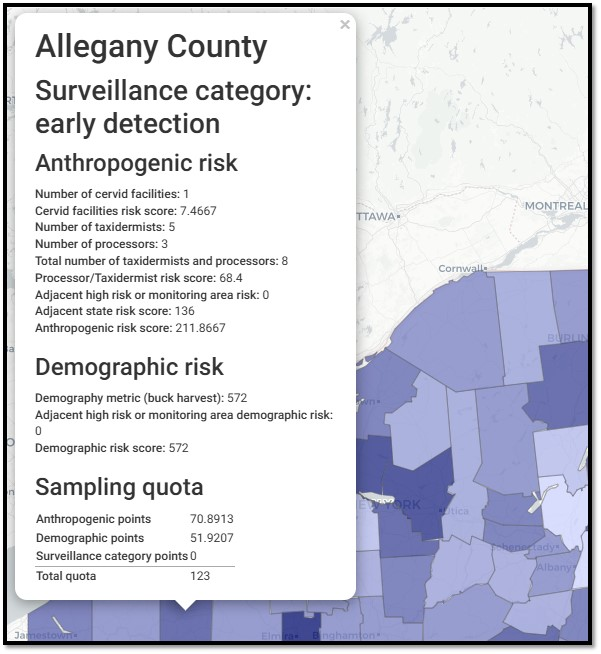

# Risk-Weighted Surveillance Quotas Model
*Deployed*

The Risk-Weighted Surveillance Quotas Model incorporates risk factors for CWD, including anthropogenic (human-related) and demographic (host population) forces to calculate surveillance quotas per sub-administrative area. Surveillance targets can be used by agencies to plan upcoming surveillance across a region, state, province, or nation.

## Geographical Scale
* Administrative area, subdivided into a sub-administrative areas

## Required Data
* Deer demography data

## Suggested Data
* Cervid facility data
* Taxidermist data
* Meat processor data

## User Inputs
* The number of surveillance points achievable for the entire administrative area 
* Surveillance categories for each sub-administrative area

## Outputs
* Surveillance quotas by sub-administrative area
* Comparative maps of quotas by surveillance category
* Risk profiles of each sub-administrative area
* Charts and comparative tables of quotas and risks

<figcaption>A map showing mock surveillance quotas produced by the Risk-Weighted Surveillance Quotas Model</figcaption>

<figcaption>Mock risk scoring and sampling quotas produced by the Risk Weighted Surveillance Quotas Model</figcaption>

## More Information
For more information, go to the [CWD Data Warehouse User Manual: Risk-Weighted Surveillance Quotas Model](https://pages.github.coecis.cornell.edu/CWHL/CWD-Data-Warehouse/risk-weighted-surveillance-quotas.html){target="_blank"}.

## Code
To view the code, go to the [GitHub Repository: Risk-Weighted Surveillance Quotas Model](https://github.com/Cornell-Wildlife-Health-Lab/risk-weighted-surveillance-quotas-model){target="_blank"}.

## Citation
* Schuler KL, Hollingshead NA, Heerkens S, Kelly JD, Hurst J, Abbott RC, Hanley BJ, Collins E, Hynes KP. A “hazard model” using risk-weighted surveillance for first detection of chronic wasting disease. In peer revision.