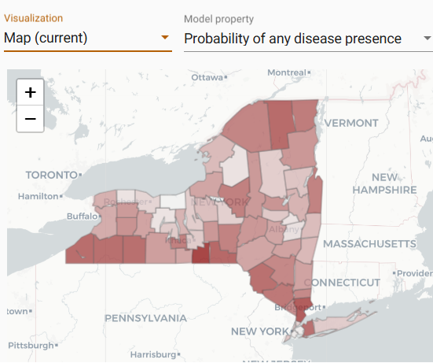
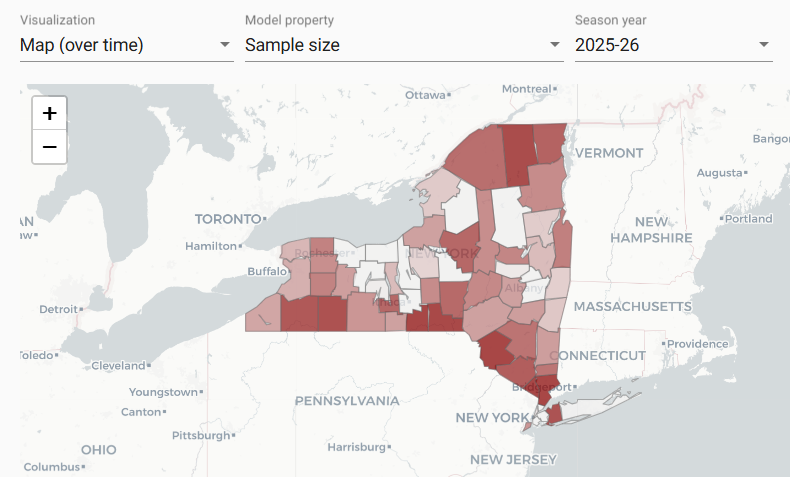
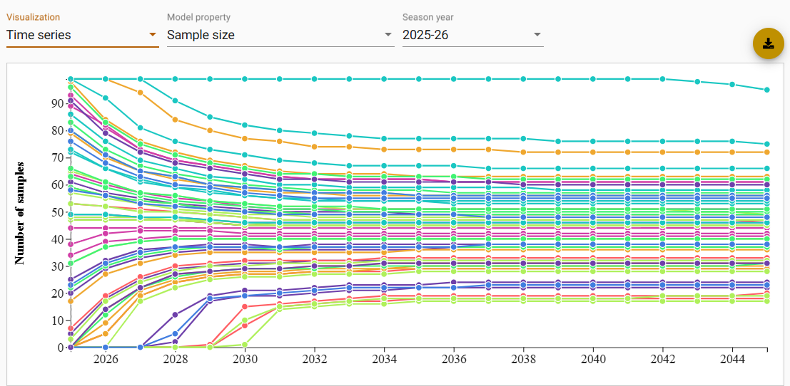
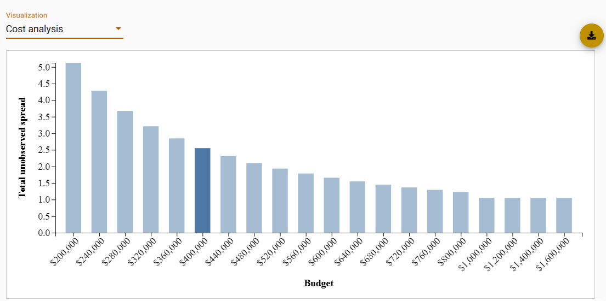

# Sample Allocation Model 

The Sample Allocation Model (SAM) uses optimal control theory to identify an optimal surveillance strategy for areas with no cases of CWD, balancing surveillance costs and the probability of CWD introduction into each area. The SAM framework provides three model settings that allow users to flexibly integrate the probability of disease spread with any historical sampling data and/or expense data to understand (1) the probability that any given area is disease-free at present, and (2) how to best allocate a surveillance budget to be able to identify the introduction of CWD as early as possible.

## Geographical Scale
* Administrative area (i.e. agency or state), subdivided into a sub-administrative areas or management units.

## Required Data
* The ability to run the [Risk-Weighted Surveillance Quotas Model](https://sop4cwd.org/warehouse/models/RiskWeightedSurveillanceQuotasModel/){target="_blank"} to obtain introduction probabilities

## User Inputs
* Annual budget of the surveillance program across the entire administrative area or agency
* Annual growth rate
* Number of years of historical data to include
* Average surveillance cost per-sample in each sub-administrative area 
* Maximum sampling capacity in each sub-administrative area

## Outputs
* Choropleth maps showing the current probability and probability over time that each sub-administrative area has CWD present or at a certain level of prevalence

<figcaption>A map showing mock probabilities for CWD disease presence.</figcaption>

* Choropleth maps showing the intensity of sampling needed over time in each sub-administrative area to achieve optimal control

<figcaption>A map showing mock surveillance quotas from the optimal control strategy produced by SAM.</figcaption>

* Time series line graphs showing mock probabilities and sampling plans over time in each sub-administrative area

<figcaption>A time series graph showing mock sample size quotas, and probabilities, over time on the optimal control strategy produced by SAM.</figcaption>

* A bar graph showing how optimal strategies on different annual budgets impact the total delayed time between introduction and detection 

<figcaption>A bar graph showing mock total unobserved spread from the optimal strategy at different budgets.</figcaption>

## More Information
For more information, go to the [CWD Data Warehouse User Manual: Sample Allocation Model](https://pages.github.coecis.cornell.edu/CWHL/CWD-Data-Warehouse/SAM.html){target="_blank"}.

## Code
To view the code once deployed, go to the [GitHub Repository: Sample Allocation Model](https://github.com/Cornell-Wildlife-Health-Lab/sample-allocation-model){target="_blank"}.

## Citation
*  Wang J, Hanley B, Thompson N, Gong Y, Walsh D, Gonzalez-Crespo C, Huang Y, Booth J, Caudell J, Miller L, Schuler K. 2025. [Strategic planning of prevention and surveillance for emerging diseases and invasive species](https://doi.org/10.1073/pnas.2507202122). _PNAS_. 

