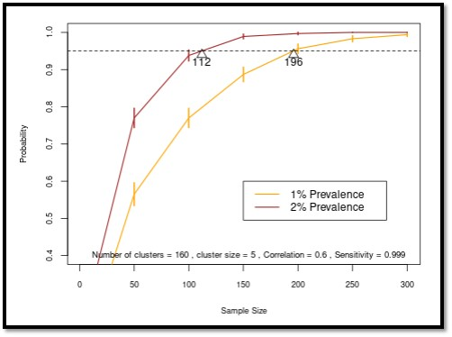

# Statistical Sample Quotas using Clustering

This model estimates the sample size needed in each subadministrative unit without finding disease to have high probability that prevalence is at or below a threshold. The model explicitly accounts for biological clusterings in the population.

## Geographical Scale
* Sub-administrative area

## Required Data
* Population size or population density

## User Inputs
* Average cluster size
* Correlation
* Sensitivity of the diagnostic test

## Outputs
* The number of animals that need to be tested in each subadministrative unit to have high probability (95%) that disease prevalence in the overall population is at or below 0.5%, 1%, 1.5%, 2%, 3%, 4%, or 5%. 

<figcaption>Example of model output showing sample size required to substantiate disease prevalence below 1%.</figcaption>

## More information

* [CWD Data Warehouse User Manual: Statistical Sample Quotas using Clustering](https://pages.github.coecis.cornell.edu/CWHL/CWD-Data-Warehouse/sample-quotas.html){target="_blank"}
